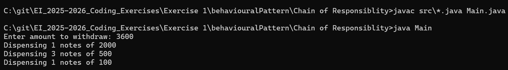

# ATM Cash Dispenser - Chain of Responsibility Design Pattern

## Description
This project demonstrates the **Chain of Responsibility Design Pattern** in Java using an **ATM Cash Dispenser** use case.  
The ATM processes withdrawal requests and dispenses cash in multiple denominations, ensuring that **each handler only handles the amount it is responsible for** and passes the remainder to the next handler in the chain.

---

## Features Implemented
- **Chain of Responsibility Pattern**: Each denomination handler (₹2000, ₹500, ₹100) processes part of the withdrawal request.  
- **Extensible Design**: New denominations can be added easily without modifying existing handlers.  
- **Orderly Cash Dispensing**: Amounts are processed in descending denominations.  
- **Defensive Handling**: Remaining unprocessable amounts are reported.  
- **Separation of Concerns**: Business logic (`CashHandler` and ATM chain) is separated from application entry point (`Main`).  

---

## Chain of Responsibility Design Pattern

### Problem
- An ATM must dispense cash in multiple denominations.  
- Hardcoding all logic in a single method makes the system difficult to maintain or extend.  
- Adding new denominations would require changing existing code, violating the Open/Closed Principle.

### Solution
- Each denomination has its own **handler class** implementing a common abstract handler (`CashHandler`).  
- Handlers are linked in a **chain**, passing unprocessed amounts to the next handler.  
- The client only sends a request to the **first handler** in the chain.

### Pros
- Flexible and extensible: adding new denominations does not break existing logic.  
- Decouples request senders from processors.  
- Promotes **Single Responsibility Principle**.

### Cons
- Chain setup must be configured correctly.  
- Slightly more complex than a single-method solution for very simple cases.  

---

## How to Run
```bash
javac src/*.java Main.java
java Main
```

## Tech Stack 
java 20.0.2

## Output
