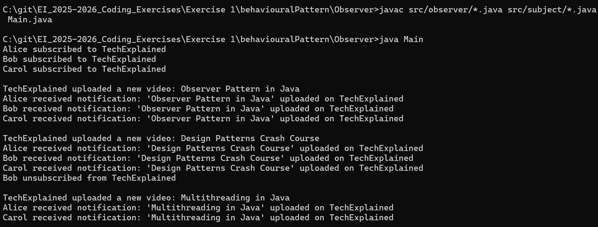

# YouTube Channel Notification System - Observer Pattern

## Description
A YouTube channel subscription notification system that demonstrates the Observer design pattern. The system allows users to subscribe to YouTube channels and automatically receive notifications whenever a new video is uploaded to any of their subscribed channels.

## Features Implemented
- Channel Subscription: Users can subscribe to YouTube channels
- Channel Unsubscription: Users can unsubscribe from YouTube channels  
- Video Upload Notification: All subscribers are automatically notified when a channel uploads a new video
- Multiple Subscribers: A channel can have multiple subscribers
- Multiple Channels: Users can subscribe to multiple different channels (extensible)

## Observer Design Pattern

The Observer pattern defines a one-to-many dependency between objects so that when one object changes state, all its dependents are notified and updated automatically.

### Problem
In a YouTube-like system, when a channel uploads a new video, all subscribers need to be notified. Without the Observer pattern, the channel would need to know about each subscriber explicitly and call notification methods directly, creating tight coupling between channels and subscribers. This makes the system difficult to maintain and extend.

### Solution
The Observer pattern solves this by implementing four key components:

- Subject Interface (ChannelSubject): Defines methods for managing observers (subscribe, unsubscribe, notify)
- Concrete Subject (YouTubeChannel): Implements the subject interface and maintains a list of observers
- Observer Interface (ChannelObserver): Defines the update method that observers must implement
- Concrete Observer (UserSubscriber): Implements the observer interface to receive notifications

When a video is uploaded, the channel notifies all its subscribers without needing to know their specific implementation details.

### Pros
- Loose Coupling: Subjects and observers are loosely coupled - they interact through interfaces
- Dynamic Relationships: Observers can be added or removed at runtime
- Open/Closed Principle: New observer types can be added without modifying existing code
- Broadcast Communication: One subject can notify multiple observers simultaneously

### Cons
- Memory Leaks: If observers aren't properly removed, they can cause memory leaks
- Unexpected Updates: Observers might receive notifications they don't need
- Complex Update Dependencies: If observers depend on each other, update order becomes important
- Performance: Notifying many observers can impact performance

## How to Run
```bash
javac src/observer/*.java src/subject/*.java Main.java
java Main
```

## Tech Stack 
Java 20.0.2

## Output
