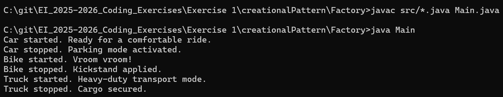

# Vehicle Management System - Factory Pattern

## Description
A vehicle creation and management system that demonstrates the Factory design pattern. The system provides a centralized way to create different types of vehicles (Car, Bike, Truck) without exposing the instantiation logic to the client code.

## Features Implemented
- Vehicle Creation: Factory creates different vehicle types based on input parameters
- Polymorphic Behavior: All vehicles implement the same interface for consistent operation
- Type Safety: Factory handles invalid vehicle types gracefully
- Extensible Design: New vehicle types can be easily added to the factory
- Uniform Interface: All vehicles support start and stop operations

## Factory Design Pattern

The Factory pattern provides an interface for creating objects without specifying their exact class. It encapsulates object creation logic and returns objects through a common interface.

### Problem
Without the Factory pattern, client code would need to directly instantiate vehicle objects using 'new' operators. This creates tight coupling between client code and concrete vehicle classes. If new vehicle types are added or existing ones are modified, all client code needs to be updated. Additionally, object creation logic gets scattered throughout the application.

### Solution
The Factory pattern solves this by implementing key components:

- Product Interface (Vehicle): Defines common interface for all vehicle types
- Concrete Products (Car, Bike, Truck): Implement the Vehicle interface with specific behaviors
- Factory Class (VehicleFactory): Contains creation logic and returns Vehicle objects
- Client Code (Main): Uses factory to create vehicles without knowing concrete classes

The factory centralizes object creation and provides a single point for managing vehicle instantiation logic.

### Pros
- Encapsulation: Object creation logic is centralized in one place
- Loose Coupling: Client code depends on interfaces, not concrete classes
- Flexibility: Easy to add new vehicle types without changing existing client code
- Code Reusability: Factory can be reused across different parts of the application
- Single Responsibility: Each class has a clear, focused responsibility

### Cons
- Increased Complexity: Adds extra layer of abstraction
- Code Overhead: More classes and interfaces need to be maintained
- Runtime Decision: Vehicle type is determined at runtime, not compile time
- Limited Flexibility: Factory needs modification when adding new vehicle types

## How to Run
```bash
javac src/*.java Main.java
java Main
```

## Tech Stack 
Java 20.0.2

## Output
