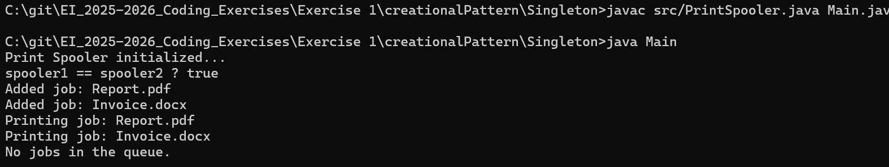

# Print Spooler - Singleton Design Pattern

## Description
This project demonstrates the **Singleton Design Pattern** in Java with a **Print Spooler** use case.  
In real systems, a print spooler manages print jobs and ensures that **only one spooler instance** exists, preventing conflicts and resource contention.

---

## Features Implemented
- **Singleton Pattern**: Only one instance of `PrintSpooler` can exist.  
- **Queue Management**: Jobs are stored in a queue and processed in order.  
- **Defensive Programming**: Prevents null or empty job names.  
- **Thread Safety**: Uses synchronized methods to handle multiple requests safely.  
- **Reusable Component**: Business logic (`PrintSpooler`) is separated from application entry point (`Main`).  

---

##  Singleton Design Pattern

###  Problem
- Multiple parts of an application may try to create separate spooler instances.  
- If more than one spooler exists, print jobs may get lost, duplicated, or corrupted.  

###  Solution
- Restrict the instantiation of the class by:  
  1. Making the **constructor private**.  
  2. Creating a **single static instance** inside the class.  
  3. Providing a **global access method** (`getInstance()`).  

###  Pros
- Controlled access to the single instance.  
- Saves memory by avoiding multiple instances.  
- Useful for shared resources like loggers, config managers, connection pools, or spoolers.  

###  Cons
- Can introduce **global state**, which may lead to hidden dependencies.  
- Difficult to unit test (tight coupling).  
- In multi-threaded scenarios, needs careful synchronization (handled here by eager initialization).  

---

## How to Run
```bash
javac src/PrintSpooler.java Main.java
java Main
```
## Tech Stack 
java -version - 20.0.2

## Output
