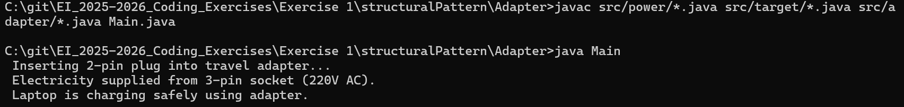

# Laptop Travel Adapter - Adapter Design Pattern

## Description
This project demonstrates the **Adapter Design Pattern** in Java with a **Laptop Travel Adapter** use case.  
In real-world systems, devices like laptops have **different plug types** and **voltages**. The adapter allows a **2-pin laptop plug** to work with a **3-pin wall socket**, ensuring **compatibility and safe operation**.

---

## Features Implemented
- **Adapter Pattern**: Converts incompatible interfaces (2-pin plug → 3-pin socket).  
- **Voltage Conversion**: Demonstrates how AC voltage from the socket can be adapted to laptop requirements.  
- **Reusable Component**: Adapter logic is separated from the client (Laptop).  
- **Defensive Programming**: Ensures safe usage of devices through adapter.

---

## Adapter Design Pattern

### Problem
- Laptops from different countries have **different plug shapes** and **voltages**.  
- Directly plugging incompatible devices into sockets can **damage the device**.

### Solution
- Create an **Adapter** that converts the **existing interface (wall socket)** to the **interface expected by the client (laptop plug)**.  
- Components:  
  1. **Adaptee**: Wall Socket (3-pin, 220V)  
  2. **Target**: Laptop Plug (2-pin)  
  3. **Adapter**: Travel Adapter converts 2-pin plug to fit 3-pin socket.  
  4. **Client**: Laptop uses adapter to get power safely.

### Pros
- Allows **incompatible interfaces to work together**.  
- Reusable for **multiple devices** and socket types.  
- Simplifies **integration with legacy or foreign systems**.

### Cons
- Slight increase in **code complexity**.  
- Adapter must be **maintained for voltage & plug compatibility**.  

---

## How to Run
```bash
javac src/power/ThreePinSocket.java src/target/TwoPinPlug.java src/adapter/TravelAdapter.java Main.java
java Main
```

## Tech stack
java -version - 20.0.2

## Output

