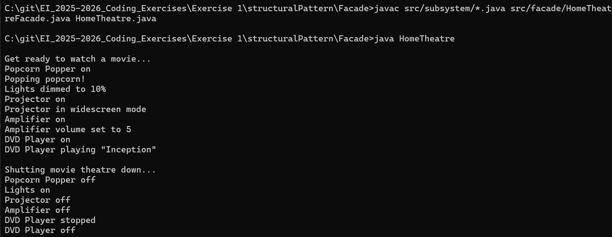

# Home Theatre - Facade Design Pattern

## Description
This project demonstrates the **Facade Design Pattern** in Java with a **Home Theatre System** use case.  
The **Facade** provides a **simplified interface** to operate a **complex subsystem** of devices (Amplifier, DVD Player, Projector, Lights, Popcorn Popper) for watching movies.

---

## Features Implemented
- **Facade Pattern**: Simplifies control of multiple subsystems.  
- **Subsystem Control**: Manages Amplifier, DVD Player, Projector, Lights, and Popcorn Popper.  
- **Reusable Component**: Business logic (`HomeTheatreFacade`) is separated from application entry point (`HomeTheatreDemo`).  
- **Simplified User Interface**: Client interacts with a single `watchMovie()` or `endMovie()` method.  

---

## Facade Design Pattern

### Problem
- Operating multiple home theatre devices manually is **complex and error-prone**.  
- Users need a **simplified interface** to control all components at once.

### Solution
- Create a **Facade class** (`HomeTheatreFacade`) that provides a **simple interface** for clients.  
- Subsystems operate internally, but the client interacts **only with the facade**.  
- Components:  
  1. **Amplifier**  
  2. **DVD Player**  
  3. **Projector**  
  4. **Theater Lights**  
  5. **Popcorn Popper**  

### Pros
- Simplifies the **client code**.  
- Reduces **dependencies between subsystems**.  
- Improves **maintainability** and **scalability**.

### Cons
- Adds an **extra layer** of abstraction.  
- Facade can become a **God class** if it controls too many subsystems.

---

## How to Run
```bash
javac src/subsystem/*.java src/facade/HomeTheatreFacade.java HomeTheatre.java
java HomeTheatre
```

## Tech stack 
java -version - 20.0.2

## Output
